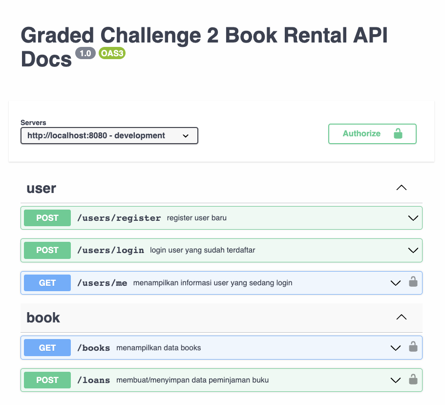
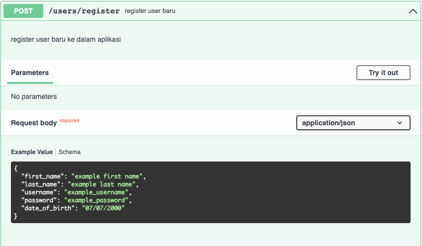
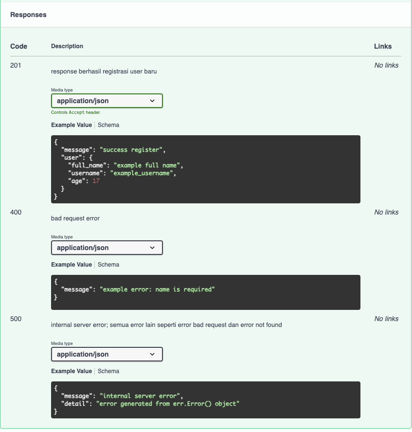

# Graded Challenge 2 - P2

Graded Challenge ini dibuat guna mengevaluasi pembelajaran pada Hacktiv8 Program Fulltime Golang khususnya pada pembelajaran Database - PostgreSQL dan Echo Framework

## Assignment Objectives
Graded Challenge 2 ini dibuat guna mengevaluasi pemahaman SQL sebagai berikut:

- Mampu memahami konsep database PostgreSQL dan implementasi ERD
- Mampu memahami query sql yang diminta
- Mampu implementasi pembuatan REST API dengan Echo Framework
- Mampu implemantasi Autentikasi menggunakan JWT pada REST API dengan Echo Framework

## Assignment Directions - Books Rental API
Sebuah platform Book Rental berencana untuk membuat sebuah aplikasi Web API, dengan menggunakan Echo Framework, GORM dan PostgreSQL. Aplikasi ini bertujuan untuk mempermudah proses registrasi user(pelanggan), dan proses peminjaman Buku, dan mempermudah pemilik platform untuk mendapatkan informasi umum mengenai platform nya.

Aplikasi ini diharapkan mampu menghandle flow pelanggan untuk register, login, melihat list movie tersedia, dan melakukan proses peminjaman buku. Dari sisi pemilik platform aplikasi ini diharapkan dapat dengan mudah menampilkan informasi umum seperti buku, author, dan genre favorit/popular di platform-nya. 

### Requirements:
- Database Requirement
  - Database harus memiliki beberapa table untuk dapat menyimpan data berikut
    - data users(pelanggan), dimana pada data yang perlu disimpan adalah first_name, last_name, email, address, dan date of birth dari pelanggan
    - data books, atau merupakan list buku yang terdapat pada platform, dimana pada table ini perlu menyimpan data title, description, min_age_restriction, cover_url, dan genre beserta dengan author nya, melingkupi first_name, last_name, dan author. Perlu diingat bahwa ada kemungkinan satu author dapat mempublish lebih dari satu buku, dan satu genre bisa terdapat di lebih dari satu buku (pertimbangkan dengan seksama, untuk desain tabel yang anda akan buat).
    - data loans, atau merupakan data peminjaman, data yang perlu disimpan meliputi, user/pengguna yang meminjam sebuah buku, buku yang dipinjam, tanggal peminjaman, dan tenggat waktu peminjaman
  - RESTRICTION
    - Pastikan email setiap user harus unik dan tidak boleh ada yang sama antar user
    - Pastikan semua field pada database tidak boleh kosong/null
  - Buatlah skema ERD berdasarkan requirement diatas, pastikan database sudah ternormalisasi minimal sampai 3NF.
  - Pastikan untuk menyertakan query DDL dan Query seeding data pada folder project GC ini, buatlah file dengan nama ddl.sql pada root folder. (jika ada)

- Web API untuk user harus memiliki beberapa fitur sebagai berikut:
  - <b>POST</b> /users/register - Menyimpan data user baru
    - Request dari endpoint ini harus meliputi nama, alamat, email, password, dan tanggal lahir
    - Response dari endpoint ini harus berupa message sukses, dan data user yang berhasil disimpan, jika terdapat kesalahan pada request maka response harus terdiri dari message yang menjelaskan kesalahan pada input request nya.
    - Perlu diperhatikan, untuk tidak mengikutsertakan data sensitif seperti password pada response
  - <b>POST</b> /users/login - Login untuk mendapatkan akses token
    - Request dari endpoint ini harus meliputi email, password
    - Response dari endpoint ini adalah akses token JWT, jika terdapat kesalahan pada request maka response harus terdiri dari message yang menjelaskan kesalahan pada input request nya.
  - Memerlukan login/autentikasi menggunakan JWT, pastikan untuk mengakses setiap endpoint dibawah, perlu disertakan akses token pada headers dengan key `authorization`, jika akses token jwt tidak terautentikasi, maka web api perlu memberikan response error tidak terautentikasi beserta message yang sesuai.
    - <b>GET</b> /users/me - Mendapatkan informasi mengenai user yang sedang login (yang token nya dicantumkan pada request headers)
      - Response merupakan data detail user, meliputi nama lengkap, alamat, tanggal lahir, beserta histori peminjaman yang pernah dilakukan user, histori peminjaman harus mencakup judul buku yang dipinjam dan tanggal peminjaman.
    - <b>GET</b> /books - Mendapatkan informasi buku yang tersedia
      - Response merupakan array of object dari data book. Pada endpoint ini perlu diimplementasikan fitur filter berdasarkan genre, gunakan query params ex: `/books?genre=2`. Data yang akan dikembalikan adalah data sesuai dengan genre yang tertera pada query params genre, jika query params genre tidak dimasukan, maka kembalikan semua data book
    - <b>POST</b> /loans - Melakukan peminjaman buku
      - Request dari endpoint ini harus meliputi data id buku yang ingin dipinjam, beserta dengan durasi peminjaman (dalam hari)
      - Response dari endpoint ini adalah data peminjaman yang berhasil dibuat, meliputi data buku yang dipinjam, tanggal peminjaman, beserta tanggal tenggat waktu peminjaman. Jika terdapat kesalahan pada request maka response harus terdiri dari message yang menjelaskan kesalahan pada input request nya.
  - Setiap endpoint diatas harus menerapkan best practice REST termasuk status code dan http method yang digunakan
  - Khusus untuk API untuk user, perlu dibuat dokumentasi API menggunakan `Swagger` dan dapat diakses pada `/swagger/index.html`

- Web API untuk admin harus memiliki beberapa fitur sebagai berikut:
  - <b>GET</b> /admin/authors - Menampilkan data aggregation author
    - Response dari endpoint ini adalah array of object dari semua author yang terdapat pada database, beserta jumlah buku yang ia publish
  - <b>GET</b> /admin/genres - Menampilkan data aggregation genre
    - Resopnse dari endpoint ini adalah array of object dari semua genre yang terdapat pada database, beserta jumlah peminjaman nya.
  - <b>GET</b> /admin/users
    - Response dari endpoint ini adalah array of object dari 5 user dengan total peminjaman terbanyak diurutkan dari yang peling banyak meminjam.
  - Setiap endpoint diatas harus menerapkan best practice REST termasuk status code dan http method yang digunakan

- Deployment Requirement
  - Buatlah database pada platform Supabase(postgreSQL) dan sambungkan dengan aplikasi anda.
  - Deploy REST API yang sudah anda buat dengan menggunakan platform Heroku, dan pastikan mencantumkan url hasil deployment pada section expected result dan deployment notes.

- Pastikan untuk mengikuti best practice untuk penggunaan environment variable

## Expected Result
- Web API dapat diakses pada _________ (isi dengan url hasil deployment anda).
- Web API memiliki endpoint sebagai berikut
  - <b>POST</b> /users/register
    - request body -> `{ first_name, last_name, address, email, password, date_of_birth }`
  - <b>POST</b> /users/login 
    - request body -> `{ email, password }`
  - <b>GET</b> /users/me
    - request headers -> `{ authorization }`
  - <b>GET</b> /books
    - request headers -> `{ authorization }`
  - <b>POST</b> /loans
    - request headers -> `{ authorization }`
    - request body -> `{ book_id, duration }`
  - <b>GET</b> /admin/authors
  - <b>GET</b> /admin/genres
  - <b>GET</b> /admin/users
- Berikut adalah contoh screenshot dari dokumentasi yang harus anda buat, sesuaikan api docs yang anda buat dengan endpoint, request, dan resopnse yang anda buat. Pastikan api documentation dapat diakses pada `/swagger/index.html`
  
  
  
## Assignment Submission
Push Assigment yang telah Anda buat ke akun Github Classroom Anda masing-masing.

### Assignment Notes:
- Jangan terburu-buru dalam menyelesaikan masalah atau mencoba untuk menyelesaikannya sekaligus.
- Jangan menyalin kode dari sumber eksternal tanpa memahami bagaimana kode tersebut bekerja.
- Jangan menentukan nilai secara hardcode atau mengandalkan asumsi yang mungkin tidak berlaku dalam semua kasus.
- Jangan lupa untuk menangani negative case, seperti input yang tidak valid
- Jangan ragu untuk melakukan refaktor kode Anda, buatlah struktur project anda lebih mudah dibaca dan dikembangkan kedepannya, pisahkanlah setiap bagian kode program pada folder sesuai dengan tugasnya masing-masing.
- Jangan lupa untuk mendokumentasikan endpoint yang dibuat dengan format OpenAPI dengan menggunakan `swaggo`.

### Additional Notes
Total Points : 100

Deadline : Diinformasikan oleh instruktur saat briefing GC. Keterlambatan pengumpulan tugas mengakibatkan skor GC 2 menjadi 0.

Informasi yang tidak dicantumkan pada file ini harap dipastikan/ditanyakan kembali kepada instruktur. Kesalahan asumsi dari peserta mungkin akan menyebabkan kesalahan pemahaman requirement dan mengakibatkan pengurangan nilai.

### Deployment Notes
- Deployed url: _________ (isi dengan url hasil deployment anda)
